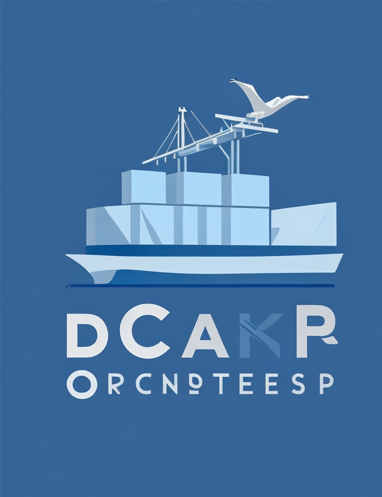

# shpyrd

### Enterprise kubernetes management

#### Goals:
    - Opensource
    - Metrics
    - Logs
    - Autoscale
    - Cost
    - Image management including builds
    - DNS and hostname management
    - Disaster recovery (Cluster recreation)
    - Zero config for apps

#### Prototype

#### Logo ideas

